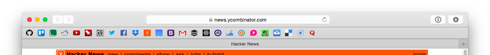

# FaviconBar
A favicon based favourites bar for Safari



##Installation

- Download the installation file: [FaviconBar.safariextz](https://github.com/umfana/FaviconBar/raw/master/FaviconBar.safariextz)
- Double-click the downloaded file and select "Install"


##Configuration

In the extension's settings (Safari > Preferences > Extensions > Favicon Bar) insert a list of links separated with semi-colons (;)

For example:

```
https://github.com/;
https://trello.com/;
https://sidefield.com;
https://www.reddit.com/r/all;
https://www.youtube.com/;
http://xkcd.com/;
```