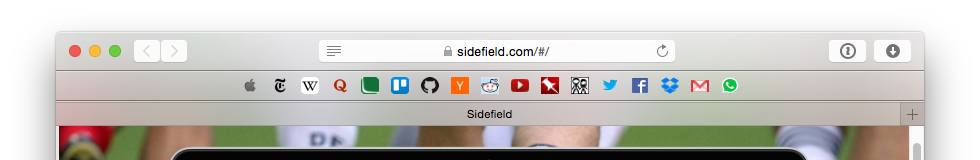

# FaviconBar
A favicon based favourites bar for Safari



##Installation

- Download the installation file: [FaviconBar.safariextz](https://github.com/umfana/FaviconBar/raw/master/FaviconBar.safariextz)
- Double-click the downloaded file and select "Install"


##Configuration

In the extension's settings (Safari > Preferences > Extensions > Favicon Bar) insert a list of links separated with semi-colons (;)

For example:

```
https://github.com/;
https://trello.com/;
https://sidefield.com;
https://www.reddit.com/r/all;
https://www.youtube.com/;
http://xkcd.com/;
```

##Support or feature requests
Please [create an issue](https://github.com/umfana/FaviconBar/issues)

##Donate
If you like the extension and it helps in your daily work, I would appreciate a donation to fund my next great idea :)

[Donate](https://www.paypal.com/cgi-bin/webscr?cmd=_s-xclick&hosted_button_id=PR8NL5R9VGMQC)

<script src="http://coinwidget.com/widget/coin.js"></script>
<script>
CoinWidgetCom.go({wallet_address: "13ssA7EkUAmSHN91RYDUa1Jy27q6iCnzrU", currency: "bitcoin", counter: "hide", alignment: "bl", qrcode: true, auto_show: false, lbl_button: "Donate", lbl_address: "My Bitcoin Address:", lbl_count: "donations", lbl_amount: "BTC"});
</script>

