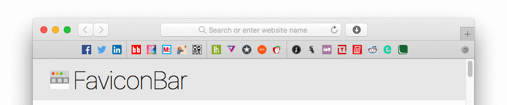
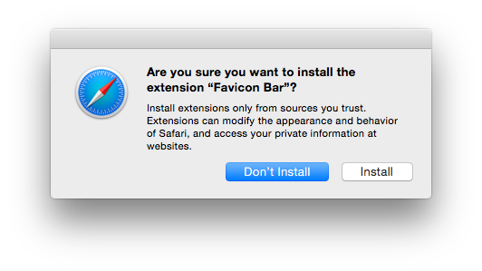
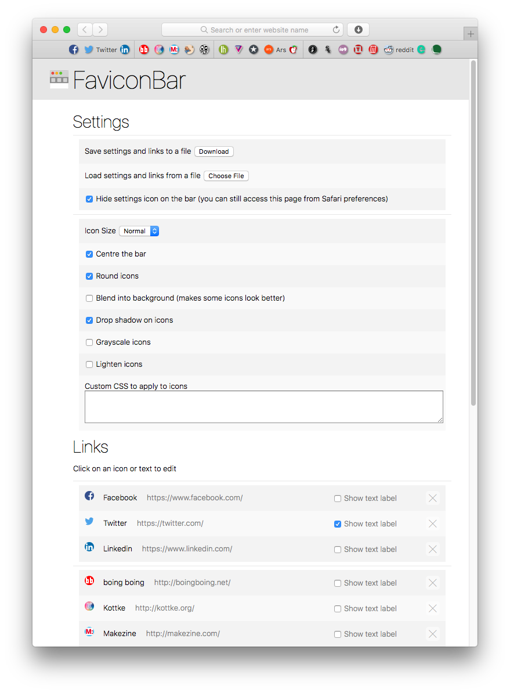

# FaviconBar
A favicon based favourites bar for Safari

## Installation

* Download the installation file: [FaviconBar.safariextz](https://github.com/RoryCombe/FaviconBar/raw/master/FaviconBar.safariextz)
* Double-click the downloaded file and select "Install"

## Features

* Drag & Drop
	- To add icons to the bar, simply drag a link from a web page or from the address bar
	- To add a custom image to an icon, just drag the image onto the icon
	- To reorder icons on your bar, drag them around

* Quick menus
	- Right-click on the bar or icons for simple changes

* Detailed settings
	- Click on the gear icon (&#x2699;) to launch the settings page for more control

* Backup settings & links to a file and load them again later, or transfer to another computer

* Open links in the current tab, new tab, or new window with hotkeys and the quick menu

## Customization

Some of the advanced features of FaviconBar

* Automatic lookup of favicons, and the ability to choose from multiple if the site offers (click on the favicon on the settings page)
	- Add your own favicon by dragging & dropping or entering a URL
* Three different icon sizes to choose from
* Easy title and link address editing (click on the title or address on the settings page)
* Text labels which can be turned on/off per icon
* Center or left-justify the bar
* Separators between icons to keep you organized
* Fancy favicon effects
	- Round icons
	- Blended icons
	- Drop Shadows
	- Grayscale
	- Lightened icons
	- CSS input for advanced customization

## Contributing
Contributions are always appreciated. If you're interested please submit a pull request, or reach out on Twitter:

Dan [@nevon](https://twitter.com/nevon)

Rory [@rorycombe](https://twitter.com/rorycombe)

## Support or feature requests
Please [create an issue](https://github.com/RoryCombe/FaviconBar/issues)
