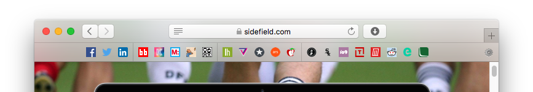

# FaviconBar
A favicon based favourites bar for Safari

##Installation

- Download the installation file: [FaviconBar.safariextz](https://github.com/umfana/FaviconBar/raw/master/FaviconBar.safariextz)
- Double-click the downloaded file and select "Install"

##Features

* Drag & Drop
	To add icons to the bar, simply drag a link from a web page or from the address bar
	To add a custom image to an icon, just drag the image onto the icon
	To reorder icons on your bar, drag them around
	
* Quick menus
	Right-click on the bar or icons for simple changes

* Detailed settings
	Click on the gear icon (&#x2699;) to launch the settings page for more control
	
* Backup settings & links to a file and load them again later, or transfer to another computer
	
##Customization

Some of the advanced features of FaviconBar include
	* Automatic lookup of favicons, and the ability to choose from multiple if the site offers (click on the favicon on the settings page)
		* Add your own favicon by dragging & dropping or entering a URL
	* Three different icon sizes to choose from
	* Easy title and link address editing (click on the title or address on the settings page)
	* Text labels which can be turned on/off per icon
	* Center or left-justify the bar
	* Separators between icons to keep you organized
	* Fancy favicon effects
		* Round icons
		* Blended icons
		* Drop Shadows
		* Grayscale
		* Lightened icons
		* CSS input for advanced customization

##Contributing
Contributions are always appreciated. If you're interested please submit a pull request, or reach out on Twitter [@rorycombe](https://twitter.com/rorycombe) - [@nevon](https://twitter.com/nevon)

##Support or feature requests
Please [create an issue](https://github.com/umfana/FaviconBar/issues)

##Donate
If you like the extension and it helps in your daily work, I would appreciate a donation to fund my next great idea :)

[Donate](https://www.paypal.com/cgi-bin/webscr?cmd=_s-xclick&hosted_button_id=PR8NL5R9VGMQC)

